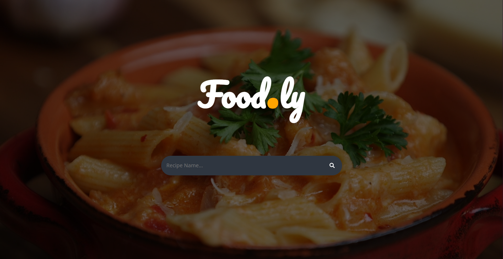
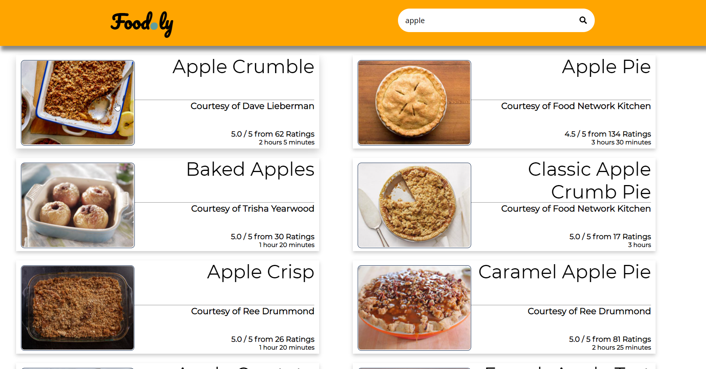
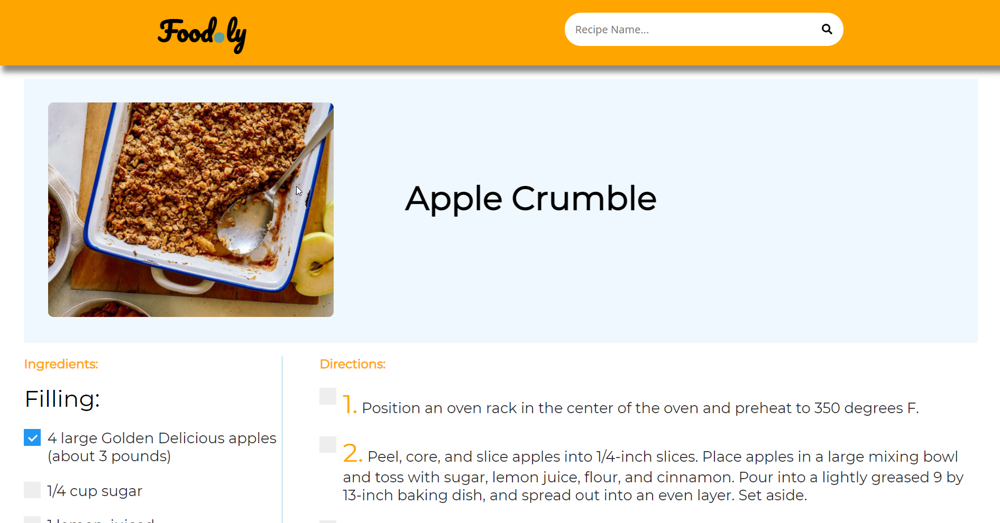

# Food.ly

## Introduction

Food.ly is a simple project designed while learning how to use Python **Flask**, **Jinja** (Flask's HTML Templating Language) and **BeautifulSoup4**. It's main features involve:

* Gathering recipes from *FoodNetwork.com*.

* Displaying the recipes in a manner that is easy-to-understand, while also removing the additional clutter from the original website.

* Providing an interactive interface that helps the user keep track of which ingredients they have and which steps of the recipe they've completed.

----

## Screenshots

### Main Page

### Options Page

### Recipe Page

----

## Using Food.ly

### Required Libraries

* Flask (v1.1.1)
* BeautifulSoup4 (v4.8.1)

### Execution

* Run the command:
>  python router.py

* Access the website interface at:
> localhost:5000